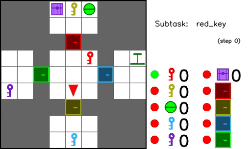

# Hierarchical Affordance Learning (HAL)

<p align="center" float="left">
  
  &nbsp;&nbsp;&nbsp;&nbsp;&nbsp;&nbsp;&nbsp;&nbsp;&nbsp;&nbsp;&nbsp;&nbsp;&nbsp;&nbsp;&nbsp;&nbsp;
  
</p>
<p align="center"><b>HAL agent completing <code>iron</code> and <code>treasure</code> tasks. More trajectories <a href="#agent-trajectories">here</a>.</b></p>

---

- Code for _[Possibility Before Utility: Learning And Using Hierarchical Affordances](https://openreview.net/forum?id=7b4zxUnrO2N)_ (Costales et al., 2022)
- The paper will appear at [ICLR 2022](https://iclr.cc/) as a _Spotlight_ presentation ([OpenReview](https://openreview.net/forum?id=7b4zxUnrO2N)) (ArXiv)
- This codebase uses algorithmic components from [ShangtongZhang/DeepRL](https://github.com/ShangtongZhang/DeepRL) and [maximecb/gym-minigrid](https://github.com/maximecb/gym-minigrid) as a starting point for the environments.
- The contributors to this codebase are [Robby Costales](https://robbycostales.com/) and [Shariq Iqbal](https://shariqiqbal2810.github.io/).

### Cite our work

```bibtex
@inproceedings{costales2022possibility,
  title={Possibility Before Utility: Learning And Using Hierarchical Affordances},
  author={Robby Costales and Shariq Iqbal and Fei Sha},
  booktitle={International Conference on Learning Representations},
  year={2022},
  url={https://openreview.net/forum?id=7b4zxUnrO2N}
}
```

<!--ts-->
### Table of contents
- [Quickstart](#quickstart) - Get up and running with this codebase
- [Agent trajectories](#agent-trajectories) - Additional agent trajectories and commentary
- [Replicating experiments](#replicating-experiments) - Replicate results from the paper
<!--te-->

---

## Quickstart

Create a new [Anaconda](https://www.anaconda.com/) environment by running the following commands. You can alternatively use Python's native [virtual environments](https://docs.python.org/3/tutorial/venv.html).

```bash
conda env create --force environment.yml
conda activate hal
```

Use `run.py` to run experiments. HAL can be trained on the `iron` task with the code below.

```bash
python run.py hdqn experiment-name --env iron --hal --max-steps 1500000
```

Run `python run.py -h` to see all options available, and go to [this section](#replicating-experiments) to see which arguments to use for replicating experiments in the main body. 

### Weights and Biases

This codebase logs data to Weights and Biases (W&B) out-of-the-box, after two quick steps.

First, open `algorithms/utils/config.py` and modify the `WANDB_ENTITY` and `WANDB_PROJECT` constants to the ones relevant to your own username/organization and project.

Then, set the W&B API key environment variable:

```bash
export WANDB_API_KEY="<your_wandb_api_key>"
```

## Agent trajectories

Below are visualizations of selected HAL trajectories on `iron` and `treasure` tasks.
The two columns to the right of the environment contain information about which items the agent currently posseses, as well as affordance values for items that are also milestones.
Solid green and red dots indicate that HAL has correctly predicted that an item is afforded or unafforded, respectively.
Concentric gren/red dots indicate that there is a mismatch; the inside value is HAL's prediction, and the outside is the ground truth.
Displayed in the top right are the agent's current action, subtask, and step number.
An alert is displayed whenever the agent collects a milestone.

### `iron` task

Below is a visualization of three HAL trajectories on `iron`.
We notice that the vast majority of affordance predictions are correct.
Note that the agent reemerges from mining to craft a stone pickaxe since a crafting bench is required for that item and the agent must be within three cells to use it.

<p align="center">
  
</p>
<p align="center"><b>HAL agent completing <code>iron</code> task.</b></p>

### Edge stochasticity

Below is a visualization of three HAL trajectories on `iron` trained with 1\% edge stochasticity, meaning that on each step there is a 1\% chance of an inventory item being removed.
This makes training even more difficult---in addition to the other challenges the agent faces, it must learn and use a useful policy and model of affordances while its progress is being reversed and consequently ground-truth affordance values are randomly changing.
The trajectories below each contain at least one such inventory removals.
We see during evaluation that affordance values are still very accurate in the face of stochasticity.
And since HAL's model of affordances is grounded in the current state, the agent is able to adapt.

<p align="center">
  
</p>
<p align="center"><b>HAL agent completing <code>iron</code> task with 1% edge stochasticity.</b></p>

Below are three HAL trajectories on `iron` with 2\% edge stochasticity.
Each of these three trajectories contain at least two inventory removals.

<p align="center">
  
</p>
<p align="center"><b>HAL agent completing <code>iron</code> task with 2% edge stochasticity.</b></p>

### `treasure` task

Below is a visualization of three HAL trajectories on `treasure`.
We see again that the affordance values are generally accurate and the agent learns a reasonable policy.

<p align="center">
  
</p>
<p align="center"><b>HAL agent completing <code>treasure</code> task.</b></p>


## Replicating experiments

Below are all of the commands needed to replicate every experiment in the main body. Appendix results can also be easily replicated with the arguments provided in `run.py`.

See all options by running `python run.py -h`. Note, some combinations of the full set of options are not compatible, and exception handling will not be clean in all cases.

Some other arguments you might wish to add are `--wb` for W&B logging (along with `--wb-tags` and `--wb-notes`) and `--save-models` to save all of the models learned so that you can later generate your own trajectories.

By default, these experiments will run on CPU. To use GPU, add this: `--gpu <gpu_id>`. To run multiple experiments over different seeds, use `--seed <seed num>`.

### Learning efficacy

#### Iron
- Oracle: `python run.py hdqn learning-oracle --env iron --aff-use-oracle --max-steps 1500000`
- HAL: `python run.py hdqn learning-hal --env iron --hal --max-steps 1500000`
- HAL-FNF: `python run.py hdqn learning-hal-fnf --env iron --aff-learn-ac --aff-use-ac --max-steps 1500000`
- H-Rainbow+HER: `python run.py hdqn learning-hrh --env iron --max-steps 1500000`
- H-Rainbow: `python run.py hdqn learning-hr --env iron --cfs 0 --max-steps 1500000`
- Rainbow: `python run.py dqn learning-r --env iron --max-steps 1500000`

#### Treasure
- Oracle: `python run.py hdqn learning-oracle --env treasure --aff-use-oracle --max-steps 1000000`
- HAL: `python run.py hdqn learning-hal --env treasure --hal --max-steps 1000000`
- HAL-FNF: `python run.py hdqn learning-hal-fnf --env treasure --aff-learn-ac --aff-use-ac --max-steps 1000000`
- H-Rainbow+HER: `python run.py hdqn learning-hrh --env treasure --max-steps 1000000`
- H-Rainbow: `python run.py hdqn learning-hr --env treasure --cfs 0 --max-steps 1000000`
- Rainbow: `python run.py dqn learning-r --env treasure --max-steps 1000000`

### Robustness to milestone selection

Be sure to individually select each value for `--msn`. We only evaluate on `iron` in our final results, but preliminary experiments on `treasure` with incomplete milestone sets demonstrated good results too. Feel free to experiment! Just note that `treasure` only has 10 milestones in total (unlike `iron` which has 11)

- HAL: `python run.py hdqn selection-hal --env iron --hal --msn <6-11> --max-steps 1500000`
- H-Rainbow+HER: `python run.py hdqn selection-hal --env iron --hal --msn <6-11> --max-steps 1500000`

### Robustness to stochasticity

Edge stochasticity only implemented for `iron`. Be sure to individually select each value for `--stoch-value`.

- HAL: `python run.py hdqn stochasticity-hal --env iron --hal --stoch-continuous --stoch-value <0.01, 0.02, 0.033> --max-steps 1500000`
- H-Rainbow+HER: `python run.py hdqn stochasticity-hrh --env iron --stoch-continuous --stoch-value <0.01, 0.02, 0.033> --max-steps 1500000`


### Task-agnostic learning

Task-agnostic learning only evaluated on `Crafting` (the full `Treasure` task has a less intricate hierarchy and the final `treasure` milestone is easily solvable by our agents than `diamond`).

- HAL: `python run.py hdqn agnostic-hal --env diamond --hal --task-agnostic-training --max-steps 1000000`
- H-Rainbow+HER: `python run.py hdqn agnostic-hrh --env diamond --hal --task-agnostic-training --max-steps 1000000`
